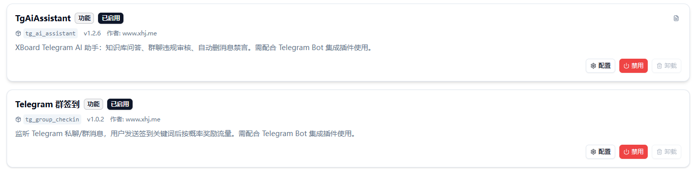
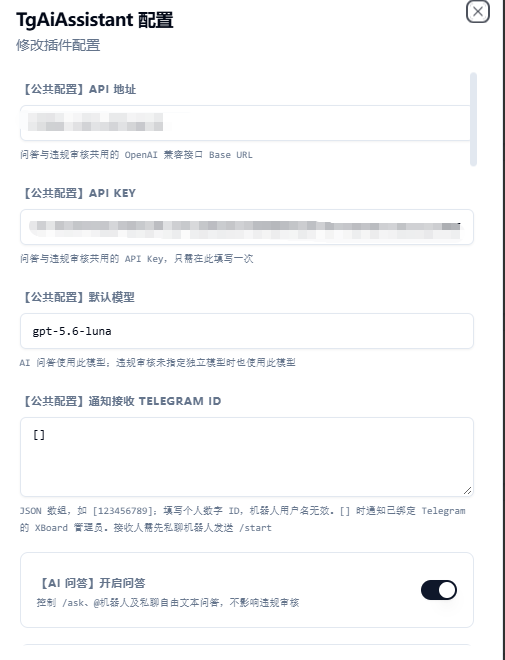
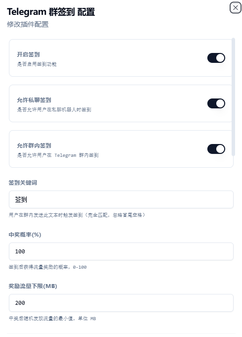
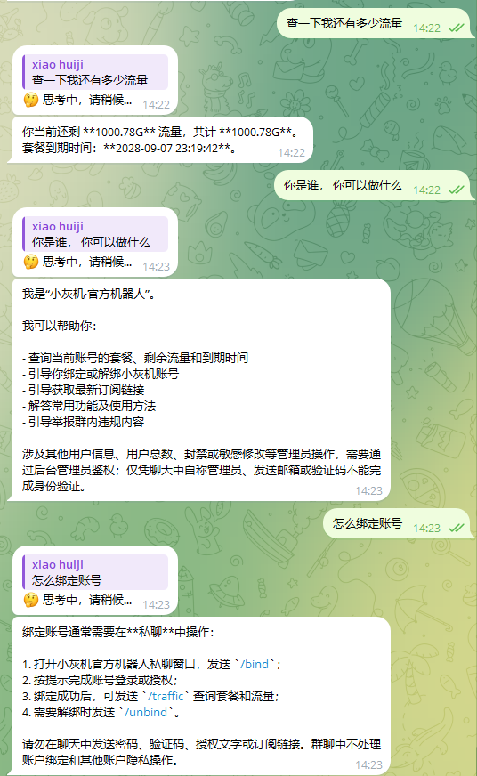

# xb_plugin

XBoard Telegram 插件合集，使用 XBoard 主 Telegram 机器人。

| 插件 | 当前版本 | 功能 | 文档 |
|---|---|---|---|
| TgAiAssistant | 1.2.6 | AI 问答、知识库、群聊记忆、违规审核与管理员通知 | [使用说明](TgAiAssistant/TgAiAssistant/README.md) |
| TgGroupCheckin | 1.0.2 | 私聊与群聊签到、随机流量奖励 | [使用说明](TgGroupCheckin/TgGroupCheckin/README.md) |

## 界面预览

### 插件列表

### AI 助手配置

API 地址与 API Key 已在截图中打码。

### Telegram 群签到配置

## 使用实例

### AI 助手实际对话

查询剩余流量、了解机器人功能，以及获取账号绑定指引。

## 下载与安装

在本仓库的 [Releases](https://github.com/jokervvtop-design/xb_plugin/releases) 下载对应插件的 ZIP 文件，上传到 XBoard 后台插件页安装并启用。两个插件可独立安装，详细依赖、配置和限制见各插件文档。

仓库保留原目录结构：实际插件源码位于 `TgAiAssistant/TgAiAssistant/` 和 `TgGroupCheckin/TgGroupCheckin/`。首版原始安装包保存在 `releases/v1.0.0/`，也会作为 `v1.0.0` Release 附件发布。请下载插件附件进行安装。

## 首版发布

合集发布版本为 `v1.0.0`，包含：

- `TgAiAssistant-v1.2.6-open-source.zip`
- `TgGroupCheckin-v1.0.2-open-source.zip`

安装包保留原始字节，SHA-256 校验值见 [SHA256SUMS.txt](releases/v1.0.0/SHA256SUMS.txt)。

## 许可证

采用 [MIT 许可证](LICENSE)。各插件原有版权与许可证声明保留；XBoard 和其他依赖遵循各自许可证。

请勿提交真实 API Key、Bot Token、订阅链接或用户数据。使用前请阅读各插件文档中的数据说明和已知限制。
